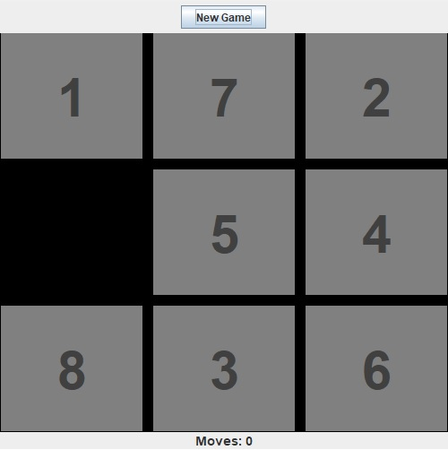

# 8 Puzzle

This project is a simple implementation of the famous 8-piece sliding puzzle, made in Java.

It consists of 8 numbered square tiles in random order with one tile missing.

The object of the puzzle is to place the tiles in order by making sliding moves that use the empty space.

## Usage
Run file 'MyPuzzle.java' and click on 'New Game'.
Then click at the numbers to slide them to the empty space, until the order of the numbers is correct.

## Screenshot

